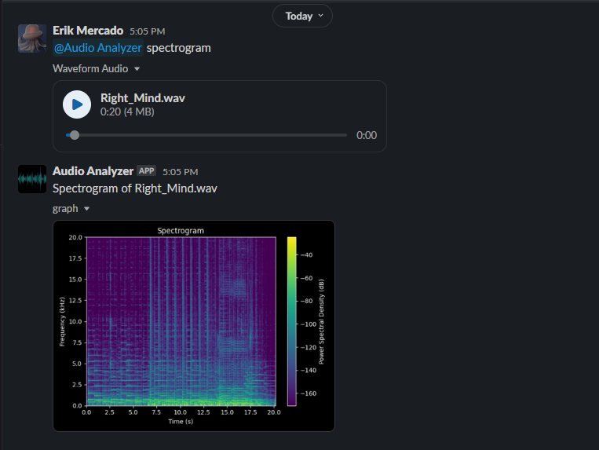

<h1>Audio Analyzer</h1>
Spectrum Analyzer, Waveform Analyzer, Filters (LPF, HPF, BSF)

<h2>Bot Commands</h2>
<table>
  <tr>
    <th>Command</th>
    <th>Description</th>
  </tr>
  <tr>
    <td>help</td>
    <td>display a list of available commands</td>
  </tr>
  <tr>
    <td>info</td>
    <td>returns information about an audio file. (channels, sample rate, bit depth)</td>
  </tr>
  <tr>
    <td>waveform</td>
    <td>returns a waveform image of an audio file</td>
  </tr>
  <tr>
    <td>spectrogram</td>
    <td>returns a spectrogram image of an audio file</td>
  </tr>
  <tr>
    <td>lpf</td>
    <td>applies a low-pass filter to an audio file, returns a spectrogram and audio file of the result (cutoff=2kHz)</td>
  </tr>
  <tr>
    <td>hpf</td>
    <td>applies a high-pass filter to an audio file, returns a spectrogram and audio file of the result (cutoff=6kHz )</td>
  </tr>
  <tr>
    <td>bsf</td>
    <td>applies a band-stop filter to an audio file, returns a spectrogram and audio file of the result (lowcut=2kHz, highcut=6kHz)</td>
  </tr>
</table>

</body>
</html>

<h2>How it Works</h2>
The project is organized into three main Python files: 
<ul>
  <li><b>Helper_Functions.py:</b> Contains functions for audio processing, such as converting stereo audio to mono, generating graphs, and applying DSP filters.</li>
  <li><b>Commands.py:</b> Implements the bot's commands and functionalities, including audio file download, processing, and sending results back to Slack.</li>
  <li><b>Main.py:</b> Sets up the bot using the Slack Bolt framework, handles events, and routes commands to the appropriate functions.</li>
</ul>
Upon receiving a mention in Slack, the bot extracts the command and parameters from the payload and directs the request to the corresponding command function. The Helper_Functions module generates graphs, applies filters, and processes audio data.
  
To activate the bot you must include the following in a message:
<ul>
  <li>Mention the Slack Bot (@AudioAnalyzer)</li>
  <li>Enter a command (Please see above)</li>
  <li>Include an Audio File</li>
</ul>
 

<h2>Comparing Results</h2>
<h3>Low-Pass Filter</h3>
<b>Slack Bot</b> 

 
<b>Sonic Visualizer</b>
 

<h3>High-Pass Filter</h3>
<b>Slack Bot</b> 

 
<b>Sonic Visualizer</b>

<h3>Band-Stop Filter</h3>
<b>Slack Bot</b> 

 
<b>Sonic Visualizer</b>

